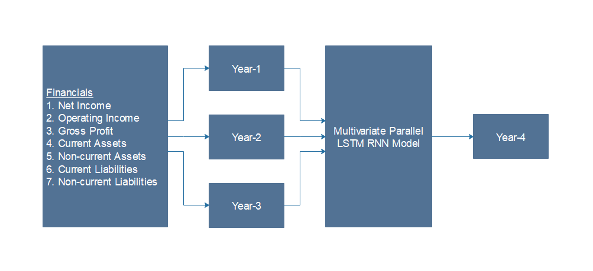

# BondAI
An AI Based Bond Credit Rating System

# Tech Stack

# Dataset Framework

### Data Accqusition

### Data preprocessing

# Credit Rating Model

### Multivariate Parallel LSTM RNN Model

### Model Analysis

### Credit Rating

# Financial Sentiment Analysis Model

### Financial Sentiment Intensity Prediction

### Stockprice Timeline Analysis

### Cummulative Sentiment vs Stockprice Fluctuations

### Random Forest Model 
